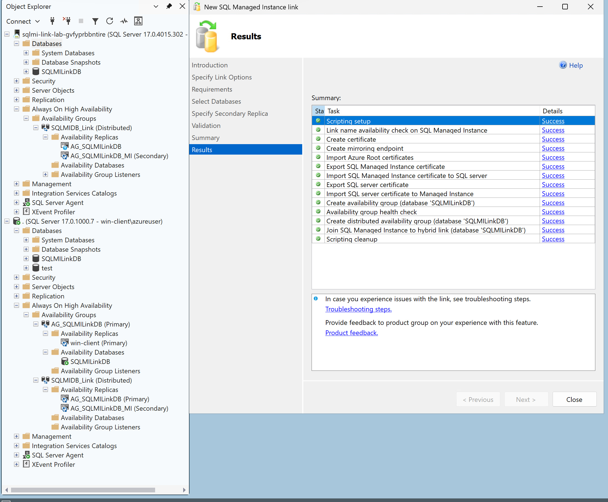
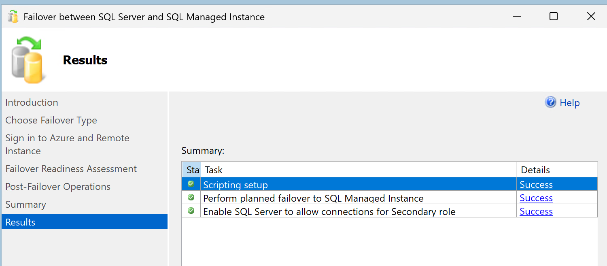
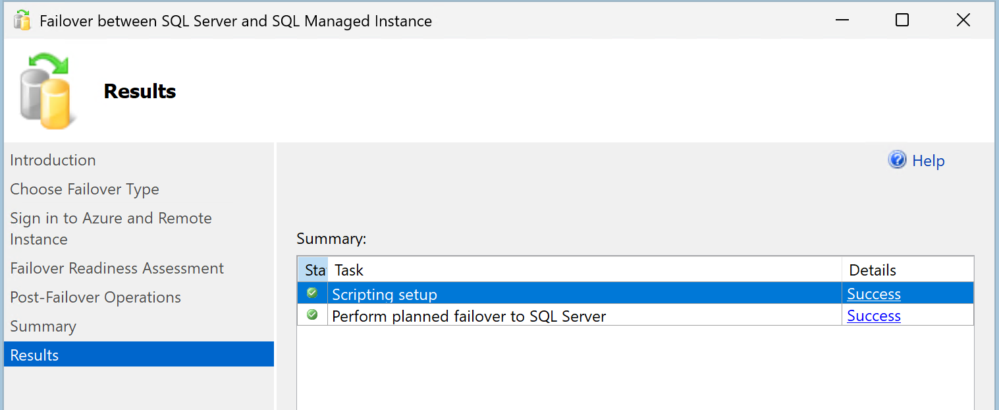

# SQL MI — Static IP Gateway

## Table of Contents

- [The Challenge](#the-challenge)
  - [Why Application Gateway Won't Work](#why-application-gateway-wont-work)
  - [Why Private Endpoint Doesn't Solve This Either](#why-private-endpoint-doesnt-solve-this-either)
- [Architecture](#architecture)
  - [Why This Works](#why-this-works)
- [Lab Environment](#lab-environment)
  - [Network Layout](#network-layout)
  - [NSG Rules](#nsg-rules)
  - [DNS](#dns)
  - [HAProxy Configuration](#haproxy-configuration)
  - [HAProxy Stats Dashboard](#haproxy-stats-dashboard)
- [Deployment](#deployment)
  - [Prerequisites](#prerequisites)
  - [1. Clone the Repo](#1-clone-the-repo)
  - [2. Login to Azure](#2-login-to-azure)
  - [3. Deploy](#3-deploy)
    - [Option A — Full Lab](#option-a--full-lab)
    - [Option B — BYO Existing VNet / Subnet / SQL MI](#option-b--byo-existing-vnet--subnet--sql-mi)
  - [Current Deployment Details](#current-deployment-details)
  - [What Gets Deployed](#what-gets-deployed)
- [Testing](#testing)
  - [Prerequisites — Hosts File Override](#prerequisites--hosts-file-override)
  - [Test 1 — HAProxy Backend Health](#test-1--haproxy-backend-health)
  - [Test 2 — MI Link Creation (SSMS Wizard)](#test-2--mi-link-creation-ssms-wizard)
  - [Test 3 — Planned Failover to SQL MI](#test-3--planned-failover-to-sql-mi)
  - [Test 4 — Planned Failover Back to SQL Server](#test-4--planned-failover-back-to-sql-server)
- [Success Criteria](#success-criteria)
- [Cleanup](#cleanup)

---

## The Challenge

Cross-cloud and hybrid VPN/firewall configurations often require a **single, fixed destination IP** on the Azure side for allow-listing and security inspection. SQL Managed Instance Link replication uses **TCP port 5022** (database mirroring), plus **port 1433** (TDS) and **ports 11000-11999** (redirect). The SQL MI FQDN resolves to an IP within the MI subnet that **can change** during maintenance or failover events.

### Why Application Gateway Won't Work

**Azure Application Gateway is a Layer 7 (HTTP/HTTPS) load balancer.** It cannot proxy raw TCP traffic.

| Capability | Application Gateway | Required |
|---|---|---|
| HTTP/HTTPS proxy | Yes | No |
| WebSocket proxy | Yes | No |
| Raw TCP forwarding | **No** | **Yes** |
| Port 5022 (DB mirroring) | **Not supported** | **Required** |
| Port 1433 (SQL TDS) | **Not supported** | **Required** |
| Ports 11000-11999 (redirect) | **Not supported** | **Required** |

SQL MI Link replication uses the database mirroring protocol on TCP 5022, SQL client connections on port 1433, and redirect ports 11000-11999. None of this is HTTP/HTTPS traffic. Application Gateway would fail immediately.

**Verdict: Right pattern, wrong Azure service.**

### Why Private Endpoint Doesn't Solve This Either

| Scenario | Port | Private Endpoint Support |
|---|---|---|
| SQL MI standard connectivity | 1433 | Yes |
| SQL MI Link / AG replication | **5022** | **No** |
| MI redirect connections | **11000-11999** | **No** |

Private Endpoint for SQL MI only supports port 1433, making it unsuitable for MI Link and redirect scenarios.

---

## Architecture

<p align="center">
  
</p>

### Why This Works

| Requirement | How It's Met |
|---|---|
| Single static IP for VPN allow-list | Load Balancer frontend: `10.0.1.10` |
| TCP 5022, 1433, 11000-11999 forwarding | LB HA Ports rule + HAProxy `mode tcp` (3 frontends) |
| Backend defined by FQDN | HAProxy `resolvers azure` with `hold valid 10s` |
| Backend IP can change | HAProxy re-resolves FQDN automatically |
| No client-side changes needed | Static IP never changes |

---

## Lab Environment

This lab deploys a **real Azure SQL Managed Instance (free tier)** behind an HAProxy TCP proxy and Internal Standard LB, proving the static IP pattern works end-to-end. The real SQL MI handles all three port ranges (5022, 1433, 11000-11999).

### Network Layout

The lab uses **two VNets with bidirectional peering** to simulate a cross-network boundary:

| VNet | CIDR | Simulates |
|---|---|---|
| `vnet-azure` | 10.0.0.0/16 | Azure side (LB + proxy + SQL MI) |
| `vnet-client` | 10.1.0.0/16 | Remote / on-premises network |

| Component | VNet | Subnet | IP |
|---|---|---|---|
| Load Balancer frontend | vnet-azure | proxy-subnet (10.0.1.0/24) | 10.0.1.10 (static) |
| HAProxy VM | vnet-azure | proxy-subnet (10.0.1.0/24) | Dynamic |
| **SQL Managed Instance** | **vnet-azure** | **mi-subnet (10.0.4.0/24)** | **Dynamic (FQDN-resolved)** |
| Client VM | vnet-client | client-subnet (10.1.1.0/24) | Dynamic + Public IP |

VNet peering allows the client to reach the LB static IP across the network boundary, simulating VPN reachability.

### NSG Rules

| Source | Destination | Port(s) | Purpose |
|---|---|---|---|
| client-subnet | proxy-subnet | 5022 | Client → LB → HAProxy (MI Link) |
| client-subnet | proxy-subnet | 1433 | Client → LB → HAProxy (SQL TDS) |
| client-subnet | proxy-subnet | 11000-11999 | Client → LB → HAProxy (MI redirect) |
| AzureLoadBalancer | proxy-subnet | 5022 | LB health probes |
| AzureLoadBalancer | proxy-subnet | 1433 | LB health probes |
| AzureLoadBalancer | proxy-subnet | 11000-11999 | LB health probes |
| proxy-subnet | mi-subnet | 5022 | HAProxy → SQL MI (MI Link) |
| proxy-subnet | mi-subnet | 1433 | HAProxy → SQL MI (SQL TDS) |
| proxy-subnet | mi-subnet | 11000-11999 | HAProxy → SQL MI (redirect) |
| * | all subnets | 22 | SSH management access |
| client-subnet | proxy-subnet | 8404 | HAProxy stats dashboard (internal only) |

### DNS

- **MI FQDN:** `<mi-name>.database.windows.net` (auto-created by SQL MI)

### HAProxy Configuration

HAProxy is configured via cloud-init to proxy **three port ranges** to the MI FQDN:

```
mode    tcp

resolvers azure
    nameserver dns1 168.63.129.16:53
    hold valid 10s

# --- MI Link (database mirroring) ---
frontend sqlmi_link_frontend
    bind *:5022
    default_backend sqlmi_link_backend

backend sqlmi_link_backend
    server sqlmi-link <MI_FQDN>:5022 check resolvers azure resolve-prefer ipv4

# --- SQL client connections (TDS) ---
frontend sqlmi_tds_frontend
    bind *:1433
    default_backend sqlmi_tds_backend

backend sqlmi_tds_backend
    server sqlmi-tds <MI_FQDN>:1433 check resolvers azure resolve-prefer ipv4

# --- MI redirect ports (connection policy = Redirect) ---
frontend sqlmi_redirect_frontend
    bind *:11000-11999
    default_backend sqlmi_redirect_backend

backend sqlmi_redirect_backend
    server sqlmi-redir <MI_FQDN> resolvers azure resolve-prefer ipv4
```

Key settings:
- `mode tcp` — Layer 4 forwarding (not HTTP)
- `resolvers azure` — Uses Azure's internal DNS (`168.63.129.16`)
- `hold valid 10s` — Re-resolves the FQDN every 10 seconds
- `resolve-prefer ipv4` — Ensures IPv4 resolution
- Three frontends cover all MI connectivity: replication (5022), TDS (1433), and redirect (11000-11999)

**Config file location:** `/etc/haproxy/haproxy.cfg`

The config is written at first boot by cloud-init. Bicep uses `replace()` to substitute the real SQL MI FQDN into the config string before encoding it as `customData`, so the file on disk contains the actual FQDN — never a placeholder.

**Auto-start on reboot:** HAProxy is enabled as a systemd service during provisioning:
```bash
systemctl enable haproxy   # registers the service to start on boot
systemctl restart haproxy  # starts it immediately after cloud-init writes the config
```
You can verify it is running at any time with:
```bash
systemctl status haproxy
```

### HAProxy Stats Dashboard

A built-in stats dashboard is enabled on **port 8404** (internal only — no public IP):

- **URL:** `http://<haproxy-private-ip>:8404/stats`
- **Access from win-client (RDP):** Open browser → `http://10.0.1.11:8404/stats`
- **Access via SSH tunnel:** `ssh -L 8404:10.0.1.11:8404 azureuser@<vm-client-public-ip>` then open `http://localhost:8404/stats`

The dashboard shows real-time status of all frontends (5022, 1433, 11000-11999), backend health checks, session counts, and bytes transferred. Auto-refreshes every 5 seconds.

---

## Deployment

### Prerequisites

- [Azure CLI](https://learn.microsoft.com/cli/azure/install-azure-cli) installed
- PowerShell 7+ (or Windows PowerShell 5.1)
- Contributor access to an Azure subscription
- [Git](https://git-scm.com/downloads) installed

> **HAProxy outbound internet requirement:** During provisioning, the HAProxy VMs run `apt-get install haproxy` via cloud-init. The proxy subnet **must** have outbound internet access. One of the following is required:
> - **NAT Gateway** — deploy with `-DeployNatGateway $true` (default); a new NAT Gateway is created and attached to the subnet
> - **Azure Firewall / NVA** — ensure outbound `*.ubuntu.com` and `*.launchpad.net` on ports 80/443 are allowed
> - **On-premises internet routing** — same outbound rules apply: `*.ubuntu.com` and `*.launchpad.net` on ports 80/443 must be reachable from the subnet
> 
> If the subnet has no outbound internet, cloud-init will silently fail and HAProxy will not start.

### 1. Clone the Repo

```powershell
git clone https://github.com/colinweiner111/sqlmi-link-static-ip-lab.git
cd sqlmi-link-static-ip-lab
```

### 2. Login to Azure

```powershell
# Interactive browser login
az login

# Confirm the correct subscription is active
az account show --output table

# (Optional) Switch subscriptions if needed
az account set --subscription "<your-subscription-id-or-name>"
```

### 3. Deploy

Two deployment modes are supported:

---

#### Option A — Full Lab

Deploys everything: two VNets, SQL MI (free tier), HAProxy VMs, LB, and a test client VM. Use this to stand up the complete validation environment from scratch.

```powershell
.\scripts\deploy.ps1 `
    -ResourceGroupName "<your-rg>" `
    -Location "<your-region>" `
    -AdminUsername "azureuser" `
    -AdminPassword (ConvertTo-SecureString "YourP@ssword123!" -AsPlainText -Force) `
    -EntraAdminObjectId "<your-entra-admin-object-id>" `
    -EntraAdminLogin "<admin@yourtenant.onmicrosoft.com>" `
    -TenantId "<your-tenant-id>" `
    -VmSize "Standard_D2s_v5"              # optional — default is Standard_D2s_v5
```

> **Entra params** — required for SQL MI creation (lab mode only). These are used to configure Entra-only authentication on the new SQL MI during deployment. They are **not needed for Option B** — in that case the SQL MI already exists and its Entra auth was configured when it was originally created. Run `az account show --query '{tenantId:tenantId}'` for your tenant ID, and `az ad user show --id <upn> --query id -o tsv` for the admin object ID.

---

#### Option B — BYO Existing VNet / Subnet / SQL MI

Deploys **only** the HAProxy VMs and Load Balancer into an existing subnet pointing at an existing SQL MI. Use this in customer environments where the VNet and SQL MI are already in place.

**Step 1 — Get your existing resource details:**

```powershell
# Get the subnet resource ID
az network vnet subnet show `
    --resource-group <your-rg> `
    --vnet-name <your-vnet> `
    --name <your-subnet> `
    --query id -o tsv

# Get the SQL MI FQDN
az sql mi list `
    --resource-group <your-rg> `
    --query "[].fullyQualifiedDomainName" -o tsv
```

> **`-LbFrontendIp`** — Choose any unused static IP from the proxy subnet's address range (e.g. `10.1.2.50`). Avoid the first four and last addresses reserved by Azure.

**Step 2 — Deploy:**

```powershell
.\scripts\deploy.ps1 `
    -ResourceGroupName "<your-rg>" `
    -Location "<your-region>" `
    -AdminUsername "azureuser" `
    -AdminPassword (ConvertTo-SecureString "YourP@ssword123!" -AsPlainText -Force) `
    -DeployMode existing `
    -ExistingProxySubnetId "/subscriptions/<subscription-id>/resourceGroups/<rg>/providers/Microsoft.Network/virtualNetworks/<vnet>/subnets/<subnet>" `
    -ExistingMiFqdn "<mi-name>.<unique-id>.database.windows.net" `
    -LbFrontendIp "<available-static-ip-in-your-subnet>" `
    -DeployNatGateway $false `
    -DeployClientVm $false `
    -VmSize "Standard_D2s_v5"
```

> **`-DeployNatGateway`** — Set to `$false` if the subnet already has outbound internet via Azure Firewall, on-premises routing, or an existing NAT Gateway. Set to `$true` (default) to deploy a new NAT Gateway alongside the HAProxy VMs. HAProxy requires outbound internet during provisioning to `apt-get install haproxy`.

**What gets deployed in existing mode:**

| Resource | Purpose |
|---|---|
| `lb-sqlmi-proxy` | Standard LB with your chosen static frontend IP |
| `vm-haproxy-1`, `vm-haproxy-2` | Two HAProxy VMs in active/active — both in LB backend pool |
| `vm-client` | Linux test client with public IP for SSH + `netcat` testing *(skipped if `-DeployClientVm $false`)* |

---

### Current Deployment Details

| Resource | Value |
|---|---|
| Resource Group | `rg-sqlmi-link-lab-v2` |
| Region | `westcentralus` |
| Admin Username | `azureuser` |
| Admin Password | *(set during deployment — check `deploy.ps1` params)* |
| LB Static IP | `10.0.1.10` |
| Client VM Public IP | *(check deployment outputs)* |
| SQL MI FQDN | *(check deployment outputs — `sqlmiFqdn`)* |
| Auth Mode | **Entra-only** (corporate policy) |

### What Gets Deployed

**Option A — Full Lab**

| Resource | Type | Purpose |
|---|---|---|
| vnet-azure | Virtual Network | 10.0.0.0/16 — Azure side (proxy + MI subnets) |
| vnet-client | Virtual Network | 10.1.0.0/16 — Simulated remote network (client subnet) |
| peer-azure-to-client / peer-client-to-azure | VNet Peering | Bidirectional connectivity |
| nsg-proxy / nsg-mi / nsg-client | NSGs | TCP 5022, 1433, 11000-11999 allow rules |
| **SQL Managed Instance (free tier)** | **SQL MI** | **Real MI endpoint (ports 5022, 1433, 11000-11999)** |
| natgw-lab + pip-natgw | NAT Gateway + Public IP | Outbound internet for proxy subnet (cloud-init) |
| rt-mi-subnet | Route Table | Required for SQL MI subnet |
| lb-sqlmi-proxy | Standard Load Balancer | Static IP entry point |
| vm-haproxy-1, vm-haproxy-2 | Linux VMs | L4 TCP proxy (active/active) |
| vm-client | Linux VM | Test client (with public IP for SSH) |
| win-client | Windows VM | Test client with SSMS (static public IP for RDP) |

**Option B — BYO Existing VNet / Subnet / SQL MI**

| Resource | Type | Purpose |
|---|---|---|
| lb-sqlmi-proxy | Standard Load Balancer | Static IP entry point in your existing subnet |
| vm-haproxy-1, vm-haproxy-2 | Linux VMs | L4 TCP proxy (active/active) |
| nat-gw + pip-natgw | NAT Gateway + Public IP | Outbound internet for HAProxy cloud-init *(skipped if `-DeployNatGateway $false`)* |
| vm-client | Linux VM | Test client for SSH + netcat validation *(skipped if `-DeployClientVm $false`)* |

---

## Testing

All validation was performed from **win-client** (Windows VM with SSMS), connecting through the HAProxy proxy via the LB static IP. This proves the solution works for real SQL MI Link operations — not just port reachability.

### Prerequisites — Hosts File Override

On win-client, add a hosts file entry so SSMS resolves the MI FQDN to the LB static IP instead of the MI's actual subnet IP:

```
# C:\Windows\System32\drivers\etc\hosts
10.0.1.10  <mi-name>.<unique-id>.database.windows.net
```

This forces all SSMS traffic (ports 5022, 1433, 11000-11999) through the proxy path:
`win-client → LB (10.0.1.10) → HAProxy → real SQL MI`

### Test 1 — HAProxy Backend Health

Open a browser on win-client and navigate to the HAProxy stats dashboard:

```
http://10.0.1.11:8404/stats
```

**Expected:** All three backends show **UP** with **L4OK** health checks:

| Backend | Status | Check |
|---|---|---|
| sqlmi_link (5022) | UP | L4OK |
| sqlmi_tds (1433) | UP | L4OK |
| sqlmi_redirect (11000-11999) | UP | L4OK |

This confirms HAProxy can reach the MI on all port ranges and is actively forwarding traffic.

### Test 2 — MI Link Creation (SSMS Wizard)

From win-client, open SSMS and connect to the source SQL Server. Run the **New SQL Managed Instance link** wizard:

1. SSMS → Object Explorer → right-click **Always On High Availability** → **New SQL Managed Instance link...**
2. Complete the wizard: select database, specify the MI as the secondary replica
3. All traffic routes through the proxy via the hosts file override

**Result:** All 14 wizard steps completed successfully:

<p align="center">
  
</p>

After completion, the Object Explorer shows:
- **AG_SQLMILinkDB** availability group with win-client as Primary
- **SQLMIDB_Link** distributed availability group replicating to MI

### Test 3 — Planned Failover to SQL MI

From SSMS, run the **Failover between SQL Server and SQL Managed Instance** wizard to fail over to the MI:

**Result:** All steps completed successfully:

<p align="center">
  
</p>

The database is now primary on SQL MI with the SQL Server as secondary.

### Test 4 — Planned Failover Back to SQL Server

Run the failover wizard again to fail back to SQL Server:

**Result:** All steps completed successfully:

<p align="center">
  
</p>

The database is primary on SQL Server again, confirming bidirectional failover works through the proxy.

---

## Success Criteria

| Criteria | Status |
|---|---|
| Single static IP presented to external networks | ✅ `10.0.1.10` via Standard LB |
| MI Link created through proxy (all 14 steps) | ✅ Certificates, AG, distributed AG, join — all succeeded |
| Planned failover to SQL MI through proxy | ✅ Database promoted on MI |
| Planned failover back to SQL Server through proxy | ✅ Bidirectional failover confirmed |
| HAProxy backends healthy on all port ranges | ✅ 5022, 1433, 11000-11999 — all UP / L4OK |
| Cross-VNet reachability via peering | ✅ win-client in vnet-client reaches LB in vnet-azure |
| Backend IP changes handled via DNS re-resolution | ✅ HAProxy `hold valid 10s` |
| No client-side changes when backend IP changes | ✅ Static LB frontend IP unchanged |

The proxy supports the **complete MI Link lifecycle** — link creation, data replication, and bidirectional planned failover — all through a single static IP.

---

## Cleanup

```powershell
.\scripts\cleanup.ps1 -ResourceGroupName "rg-sqlmi-link-lab-v2"
```
